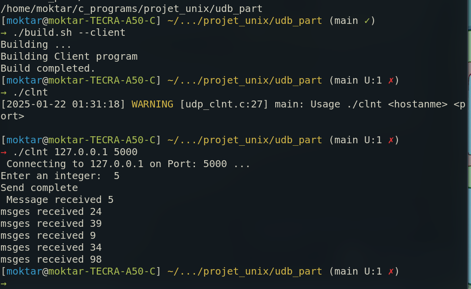
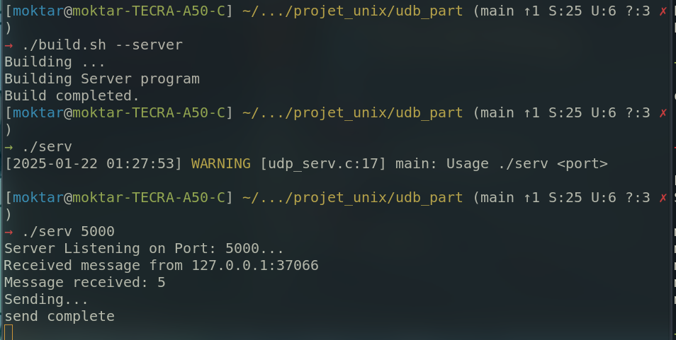
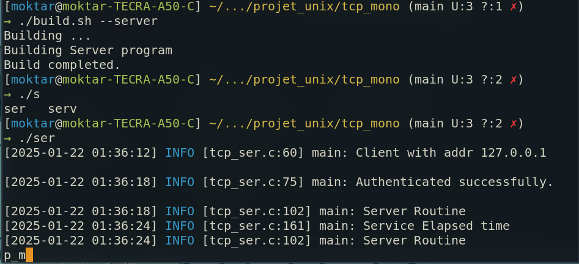
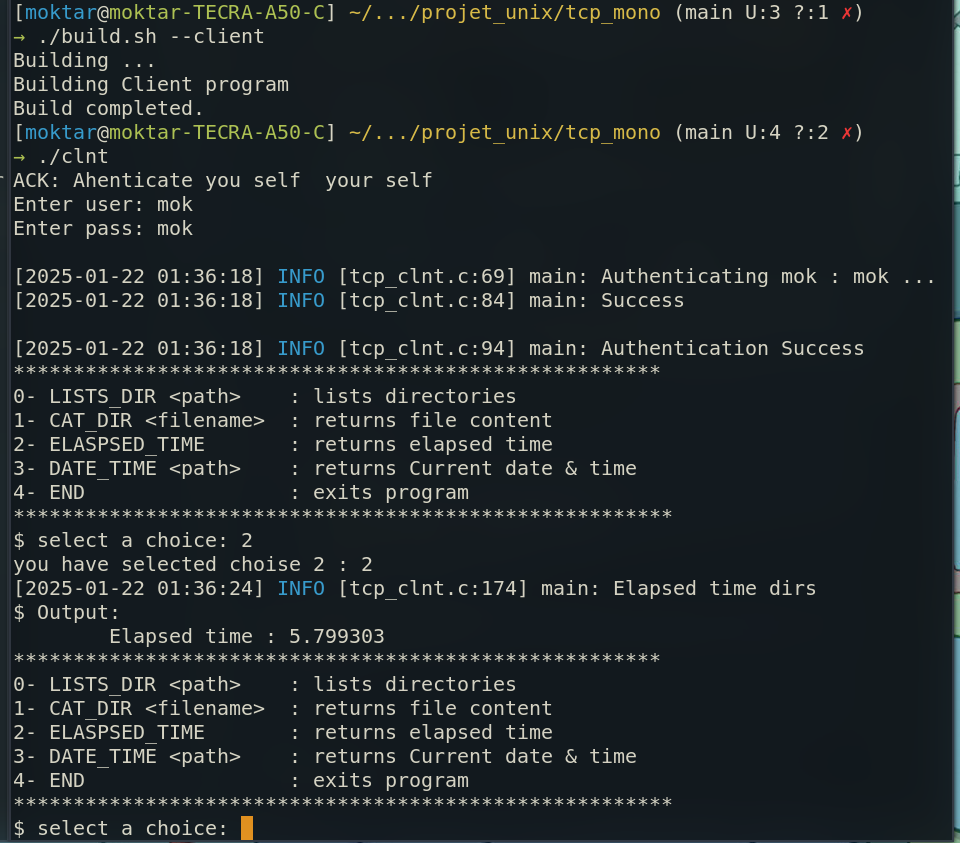
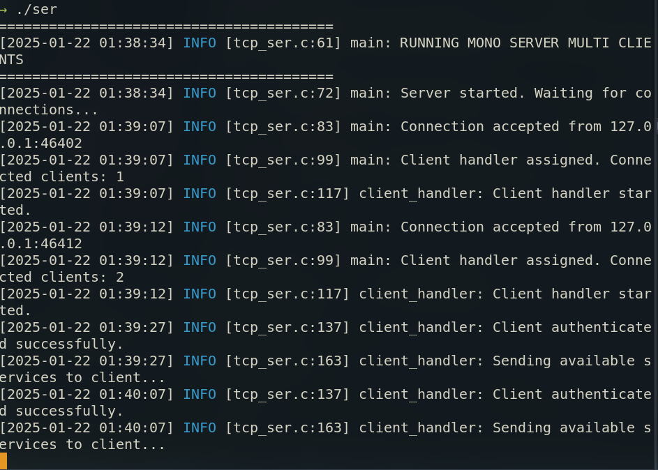
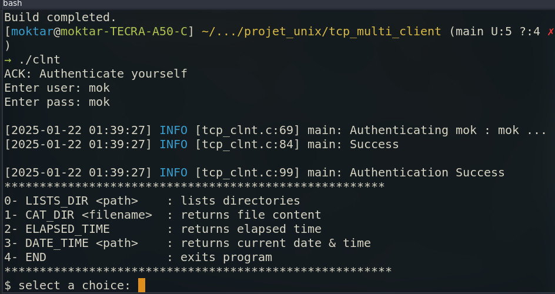
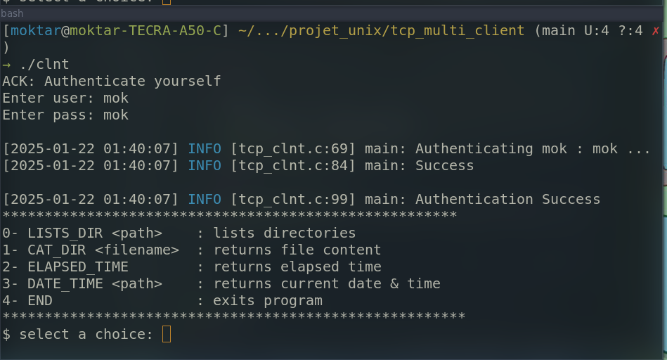
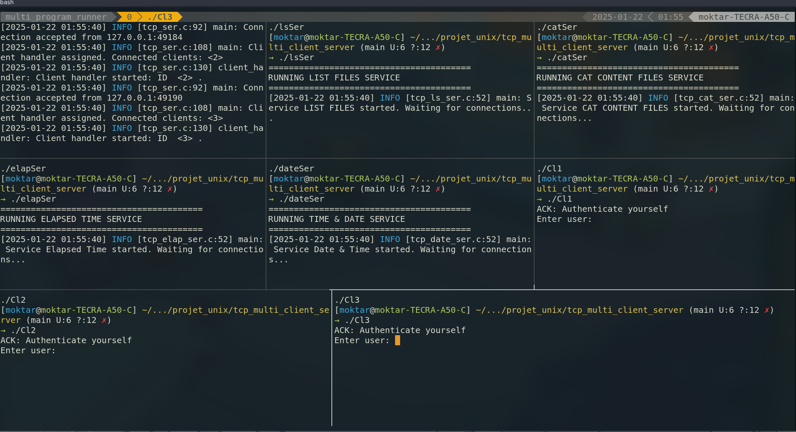
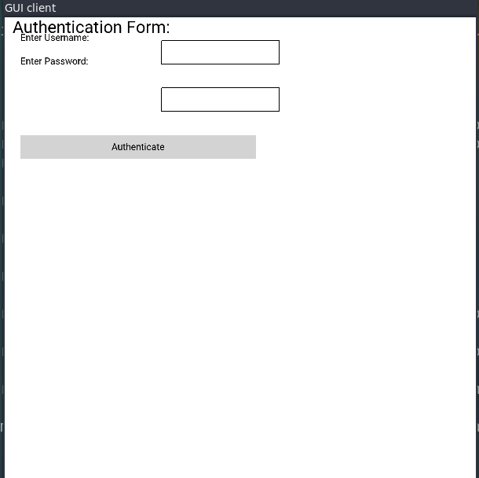
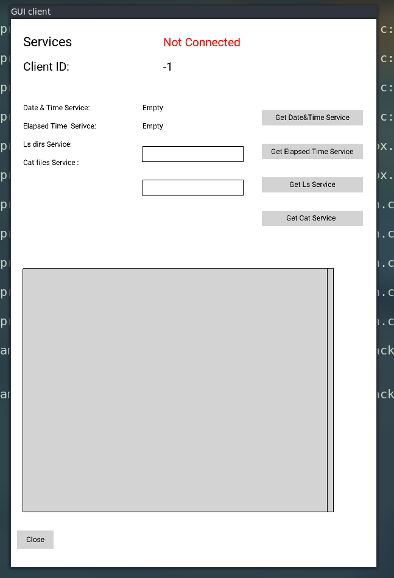

# Rapport de Projet UNIX SOCKET
**Presented by:<br>**  

    - Moktar SELLAMI
    - Mariem NAJJAR
---

# 1. Contexte du Projet
Le thème principal de ce projet consistait à implémenter des solutions de communication réseau en utilisant les protocoles UDP et TCP. L'objectif était de créer plusieurs variantes de client-serveur en fonction des configurations demandées. Les différentes étapes du projet incluaient :

- **UDP Mono Client/Server** : Implémentation d'une communication simple entre un client unique et un serveur unique en utilisant le protocole UDP, sans connexion.

- **TCP Mono Client/Server** : Mise en place d'une connexion fiable entre un client unique et un serveur unique en utilisant le protocole TCP.

- **TCP Multi Client/Mono Server** : Extension à plusieurs clients pouvant communiquer avec un serveur unique via le protocole TCP.

- **TCP Multi Client/Multi Server** : Mise en œuvre d'une architecture plus complexe avec plusieurs clients interagissant avec plusieurs serveurs.

- **GUI TCP Multi Client/Multi Server** : Développement d'une interface graphique permettant de contrôler l'interaction des clients avec les serveurs.  
  Pour la bibliothèque graphique, j'ai utilisé **GooeyGUI**, une librairie créée par Moktar Sellami et Mohamed Yassine Ahmed Ali.  
  > Malheureusement, je n'ai pas terminé cette tâche. Le problème ne vient pas seulement de la bibliothèque, mais également de la manière dont je l'ai utilisée. Mon design, qui repose sur deux threads (un pour Newtonking et un pour l'interface graphique), n'est pas encore supporté par la bibliothèque, ce qui entraîne un comportement indéfini.
Vous pouvez consulter la bibliothèque ici : [https://github.com/YASSINE-AA/GooeyGUI](https://github.com/YASSINE-AA/GooeyGUI)


# 3. Architecture et Conception
Le thème principal de ce projet consistait à implémenter des solutions de communication réseau en utilisant les protocoles UDP et TCP. L'objectif était de créer plusieurs variantes de client-serveur en fonction des configurations demandées.

Ci-dessous, je vais expliquer la conception et l'approche adoptées pour chaque tâche :  
### 3.1 UDP Mono Client/Server
##### **Architecture Serveur : `udp_serv.c`**
1. **Vérifier les arguments** : Le programme accepte uniquement un argument, le port du serveur.
2. **Créer un socket UDP** : Utilisation de la fonction `socket()` pour créer un socket de type `SOCK_DGRAM`.
3. **Configurer et lier l'adresse du serveur** : Initialisation de la structure `sockaddr_in` pour définir l'adresse et liaison au socket avec `bind()`.
4. **Recevoir un message du client** : Utilisation de la fonction `recvfrom()` pour lire les données envoyées par le client.
5. **Générer une séquence aléatoire** : Traitement de la requête reçue en générant une séquence aléatoire, basée sur les données du client.
6. **Envoyer la réponse au client** : Envoi de la réponse via `sendto()` au client.
7. **Fermer le socket** : Fermeture du socket avec la fonction `close()`.

---

##### **Architecture Client : `udp_clnt.c`**
1. **Vérifier les arguments** : Le programme vérifie la validité des arguments, à savoir l'hôte (adresse IP/nom de domaine) et le port du serveur.
2. **Créer un socket UDP** : Création du socket client avec `socket()` de type `SOCK_DGRAM`.
3. **Configurer l'adresse du serveur** : Définir les informations nécessaires pour contacter le serveur (adresse IP et port).
4. **Générer un nombre aléatoire et préparer un message** : Création d'une requête avec un nombre aléatoire généré localement.
5. **Envoyer et recevoir le message au serveur** :  
   - Envoi de la requête au serveur via `sendto()`.
   - Réception de la réponse via `recvfrom()`.
6. **Afficher les valeurs reçues** : Impression des données retournées par le serveur sur la console.
7. **Fermer le socket** : Fermeture propre du socket avec la fonction `close()`.


##### **Fichier `common.h`**
- Contient une structure de données qui représente le format des messages échangés entre le client et le serveur :  

```c
typedef struct { 
  int n;           // Nombre aléatoire généré par le client  
  int arr[NMAX];   // Réponse du serveur 
} message;
```
---

### **Fichier `logger.h`**
- Utilisé dans le serveur pour offrir un affichage intuitif, probablement pour afficher des messages de journalisation ou des événements importants (par exemple, réception ou envoi de messages).

---

##### **Le fichier `build.sh`**
un script shell qui sert a compiler le serveur et le client 
> j'ai utilise `getops` pour la tokanization
```bash 
./build.sh --client || ./build.sh -C    # compiler code client 
./build.sh --serveur || ./build.sh -S   # compiler code serveur
```
<div style="display: flex; justify-content: space-between;">
  
  
</div>

### 3.2 TCP Mono Client/Server
##### **Structure du message échangé entre le serveur et le client :**
```c
typedef struct
{
    Services_e serviceType; // Message type
    MessagePayload payload; // Message payload
} Message;
```
Le type `MessagePayload` est une union qui contient tous les types de données pris en charge pour les échanges entre le client et le serveur :
```c
typedef union
{
    ListCatPayload listCatPayload;
    ElapsedTimePayload elapsedTimePayload;
    AuthPayload authPayload;
    ACKPayload ackPayload;
    TimeDatePayload timeDatePayload ; 
} MessagePayload;
```
Lors de l'envoi d'un message, le type de service est spécifié à l'aide de l'énumération Services_e :
```c
typedef enum
{
    LISTS_DIR = 0,  // Service pour demander la liste des fichiers d'un répertoire
    CAT_DIR,        // Service pour demander le contenu d'un fichier
    ELASPSED_TIME,  // Service pour demander le temps écoulé
    DATE_TIME,      // Service pour demander la date et l'heure
    END,            // Indique que le client souhaite terminer la communication
    AUTH,           // Service d'authentification avec envoi des identifiants
    ACK             // Service pour envoyer des messages simples (erreurs ou confirmations)
} Services_e;
```
Pour chaque type de message, des structures définissant les données du message (payload) sont créées :
```C 
/// Payload pour les services LISTS_DIR et CAT_DIR
typedef struct
{
    char directory_path[256]; // Chemin du répertoire ou fichier
    char output[1024];        // Résultat du service
} ListCatPayload;

// Payload pour le service ACK
typedef struct
{
    char msgACK[1024]; // Message de confirmation ou d'erreur
} ACKPayload;

// Payload pour le service DATE_TIME
typedef struct
{
    char date[50];     // Jour actuel
    char time[50];     // Heure actuelle
} TimeDatePayload;

// Payload pour le service ELASPSED_TIME
typedef struct
{
    double elapsed_time_s; // Temps écoulé (en secondes)
} ElapsedTimePayload;

// Payload pour le service AUTH
typedef struct
{
    char username[50]; // Identifiant
    char password[50]; // Mot de passe
} AuthPayload;


```
---
##### **Architecture `netwok.c`** :
Contient des fonctions utilitaires pour la gestion réseau :
```C
// Initialisation sécurisée du socket (gère les erreurs)
int SafeInitSocket(int port); 

// Écoute du socket (gère les erreurs)
void safeListen(int queueSize); 

// Envoi sécurisé d'un message (gère les erreurs)
void safe_send(int service_fd, int sock, Message* message); 

// Réception sécurisée d'un message (gère les erreurs)
void safe_rcv(int service_fd, int sock, Message* message); 
```
---

##### **Architecture : `services.c`**:
Implémentation des services (`ls`,`cat`,`date&time`, `elapsed time`) :
```c
// Service d'authentification (utilisateur et mot de passe codés en dur : 'mok' & 'mok')
bool Authenticate(const char* username, const char* psswd);

// Liste les fichiers d'un répertoire (utilise `fork` pour exécuter la commande `ls`)
void ListDirectories(const char *path, char *buff, size_t buff_size);

// Récupère le contenu d'un fichier (utilise `fork` pour exécuter la commande `cat`)
void getFileContent(char* filename, char* buff, size_t buff_size);

// Récupère la date et l'heure actuelles
void getDateTime(char* _time, size_t time_size, char* _date, size_t date_size);

// Calcule le temps écoulé entre deux appels (premier appel : `fcapture = false`)
void getElapsedTime(bool fcapture, double* elapsed);
```
--- 
##### **Client `tcp_clnt.c`** :
1. Connexion au serveur. 
2. Authentification sécurisée. 
3. Envoi des commandes via une boucle. 
4. Réception des résultats du serveur et affichage.  
5. Fin de session après envoi de la commande `END`.  
6. Fermeture propre du socket. 
---

##### **Serveur `tcp_ser.c`** :
1. Initialisation du serveur.
2. Acceptation des connexions client.
3. Authentification sécurisée.
4. Envoi d’un menu des options disponibles.
5. Traitement des requêtes du client (services variés).
6. Attente d'une nouvelle action du client ou fin de session. 

----
##### **Le fichier `build.sh`**
un script shell qui sert a compiler le serveur et le client 
> j'ai utilise `getops` pour la tokanization
```bash 
./build.sh --client || ./build.sh -C    # compiler code client 
./build.sh --serveur || ./build.sh -S   # compiler code serveur
```

<div style="display: flex; justify-content: space-between;">
  
  
</div>

### 3.4 TCP Multi Client/Mono Server

Le serveur est conçu pour accepter et gérer plusieurs connexions clients simultanément, avec un maximum de 10 connexions spécifiées dans l'appel `listen()` :

```c
listen(fd, 10);
```

##### Modifications pour Supporter plusieurs Connexions
Le client reste inchangé, mais le serveur utilise des threads pour gérer plusieurs clients en parallèle.

---

##### Gestion Multi-Client avec Threads
- **Threads** : Pour chaque connexion client, un nouveau thread est créé à l'aide de `pthread_create`.
- **Synchronisation** : Les threads partagent certaines ressources (comme le compteur `active_clients`) qui nécessitent une synchronisation pour éviter les conflits. 
- **Mutex** : Utilisation de `pthread_mutex_lock` et `pthread_mutex_unlock` pour synchroniser les accès aux ressources partagées.
---
##### Gestion des Interruptions avec un Signal Handler

- Pour gérer proprement les interruptions de l'utilisateur (Ctrl+C), un gestionnaire de signaux est ajouté :
  ```c
  signal(SIGINT, handle_interrupt);
  ```
- Ce gestionnaire permet de libérer les ressources avant de fermer le serveur.

<div style="display: flex; justify-content: center;">
  
</div>

`
`
<div style="display: flex; justify-content: space-between;">
  
  
</div>

### 3.5 TCP Multi Client/Mutlti Server
Donc  jai repartie le code les service que le serveur excute en plusieur serveur. J'ai obtenu 
- serveur proxy: 
- serveur pour la service`date&heur`
- serveur pour la service`temps ecoule`
- serveur pour la service`list fichers (ls)`
- serveur pour la service`afficher contenu fichier (cat)` 

j'ai associa a chaque serveur un port specefique `services.h`: 
```c
#define PORT_LIST_DIR_SERVICE 5081
#define PORT_ELAPSED_TIME_SERVICE 5082
#define PORT_CAT_CONTENT_SERVICE 5083
#define PORT_TIME_DATE_SERVICE 5084
 
```
Le serveur proxy est responsable :
- Accepter les demandes des clients.
- Authentifier les clients.
- Transmettre la demande du client au serveur qui exécute le service demandé.
- Recevoir la réponse du serveur de service X.
- Envoyer la réponse au client.
> chaque client est handler dans une tache specifique 

##### **etape communication client serveur:** 
1. Le client se connecte au serveur proxy.
2. Le serveur proxy authentifie le client.
3. Le serveur proxy attend une demande de service du client.
4. Le serveur proxy transmet la demande au serveur qui exécute le service spécifique.
5. Le serveur proxy reçoit la réponse du serveur de service.
6. Le serveur proxy renvoie la réponse au client.

---

##### Compilation et exceution
```bash 
./build.sh --client || ./build.sh -C    # compiler code client 
./build.sh --serveur || ./build.sh -S   # compiler code serveur
```
pour l'execution j'ai ajouter un script qui lance le proxy, les service et 3 client dans terminale en utilisant `tmux`. 
```bash
./build.sh --run) || ./build.sh -r   # compiler code serveur
```
> Tmux est un multiplexeur de terminal open-source pour les systèmes d'exploitation de type Unix. Il permet d'accéder simultanément à plusieurs sessions de terminal dans une seule fenêtre.
<div style="display: flex; justify-content: center;">
  
</div>

### 3.5 GUI TCP Multi Client/Multi Server
J'ai intégré le code de l'interface graphique comme suit :

Comme mentionné précédemment, j'ai séparé le code de l'interface graphique et celui de la communication réseau (client-serveur) en deux threads distincts. Le thread principal exécute le code graphique, tandis qu'un autre thread est créé pour gérer toute la partie réseau (communication entre serveur client).
> J'ai fait cela parce que, dans le code de réseau, le client attend une réponse du serveur. Cela introduit des blocages dans le code, ce qui fait que l'interface graphique (GUI) se fige. 
---
##### **Interface graphique** :
J'ai créé deux interfaces graphiques (fenêtres) :

- Une pour l'authentification
- Une autre pour les services
---
##### **Je contrôle la visibilité de ces deux interfaces** :

- Lorsque le client est dans la phase d'authentification, l'interface d'authentification est activée, et l'interface des services est désactivée.
- Une fois l'authentification réussie, l'interface des services est activée, et celle d'authentification est désactivée.
**Fichier `ui.c` :**
J'ai ajouté un fichier `ui.c`qui implémente le rendu des interfaces graphiques avec les fonctions suivantes :

```c
void create_services_layout();               // Création de l'interface des services
void Create_authentification_layout();       // Création de l'interface d'authentification  
// Fonctions pour gérer l'interface
void setUserID(int ID);
void set_ConnectionStatus(bool st);
char* getUserName();
char* getPasswd();
char* getFilename(); 
char* getPath(); 
void printOUputContent(); 
void setDateTime(char* date,char* time); 
void setElapsedTime(double etime); 
```
---
##### **Dossier GooeyGUI :**

Le dossier GooeyGUI contient la bibliothèque nécessaire (fichiers d'en-tête `.h`et fichiers `.so` requis pour `dynamic linking`).

---

Le code du serveur restes le mems,

Erreur que j'ai rencontrait:
```bash
X Error of failed request:  BadAccess (attempt to access private resource denied)
  Major opcode of failed request:  152 (GLX)
  Minor opcode of failed request:  5 (X_GLXMakeCurrent)
  Serial number of failed request:  3198
  Current serial number in output stream:  3198
```
Je suis actuellement en train de tester une autre méthode pour résoudre le problème rencontré.

---

##### Compilation et exceution
```bash 
./build.sh --client || ./build.sh -C    # compiler code client 
./build.sh --serveur || ./build.sh -S   # compiler code serveur
```
<div style="display: flex; justify-content: space-between;">
  
  
</div>

## 6. Conclusion

Ce projet a permis de comprendre les différences fondamentales entre les protocoles UDP et TCP, ainsi que les défis liés à la gestion de multiples connexions et à la création d'interfaces graphiques pour des applications réseau.
